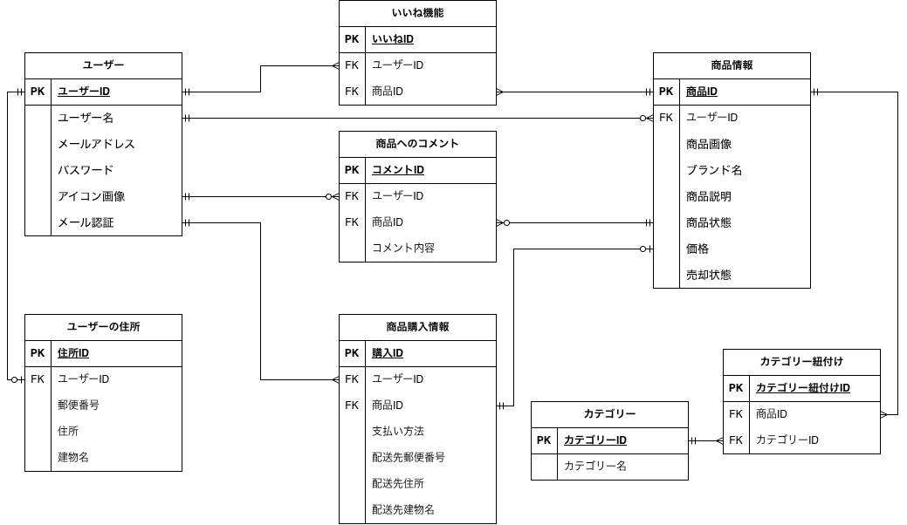

# お問い合わせフォーム

フリーマーケット形式で商品の出品・購入・決済・メール認証ができるWebアプリケーションです。

## 環境構築

### Docker ビルド

1.  git clone git@github.com:hiori03/fleamarket-app.git
2.  docker-compose up -d --build

＊MySQL は、OS によって起動しない場合があります。それぞれの PC に合わせて docker-compose.yml ファイルを編集してください。

### Laravel 環境構築

1.  docker-compose exec php bash
2.  composer install
3.  .env.example ファイルから.env を作成し、環境変数を変更
4.  php artisan key:generate
5.  php artisan migrate
6.  php artisan db:seed

## PHPUnitテスト

### テスト環境 (.env.testing) の設定

1.  cd src
2.  cp .env.testing.example .env.testing

### テスト用DB作成

1.  docker-compose exec mysql mysql -u root -p
2.  CREATE DATABASE fleamarket_test;
3.  docker-compose exec php bash
4.  php artisan migrate --env=testing

### テストの実行

-   php artisan test

## Stripe設定

-   .env に STRIPE_KEY / STRIPE_SECRET / STRIPE_WEBHOOK_SECRET 設定

## 管理者ユーザー情報

-   メール: test@example.com
-   パスワード: password

## 使用技術(実行環境)

-   Laravel 8.83.29 (FPM)
-   Laravel Fortify
-   Laravel Pint 1.26.0
-   PHP 8.1.33
-   Nginx 1.29.3
-   MySQL 9.4.0
-   phpMyAdmin
-   Docker / Docker Compose
-   Stripe 18.2.0
-   MailHog

## ER 図

## URL

-   開発環境：http://localhost/
-   phpMyAdmin：http://localhost:8080/
-   MailHog：http://localhost:8025/
-   案件シート：https://docs.google.com/spreadsheets/d/1_ZSRE1U25nmKNCRvkwMLfIA8n1iH1eoVXfCfFmikDdY/edit?usp=sharing